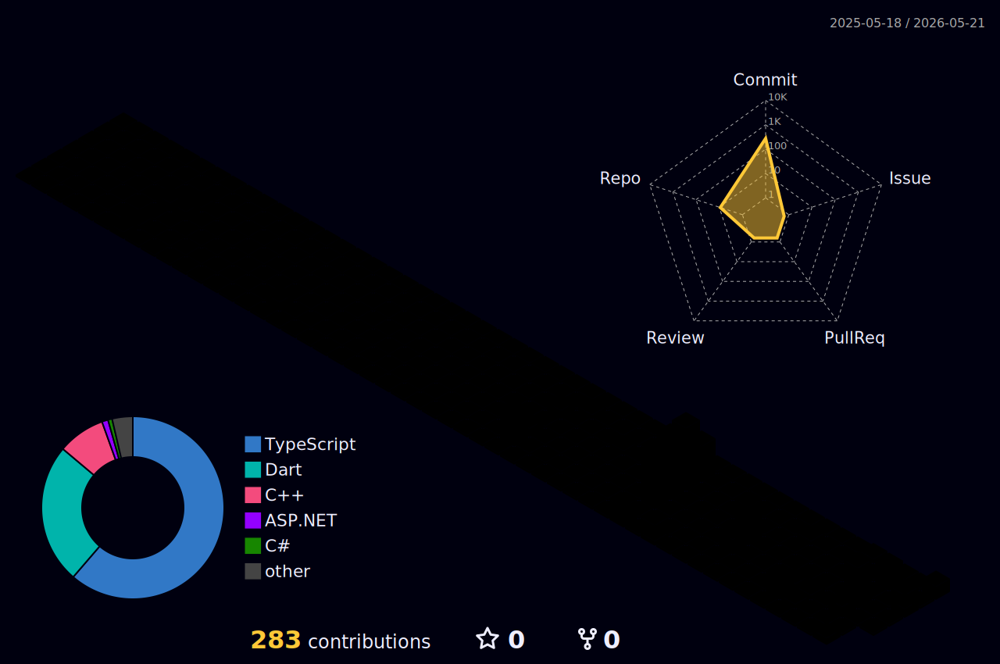

<div align="center">

[](https://git.io/typing-svg)

<br/>

[](mailto:eneskotay23@gmail.com)
[](https://linkedin.com/in/eneskotay)
[](https://twitter.com/eneskotay)
[](https://eneskotay.dev)
[](https://hayattan.net)


</div>

---


## 👨‍💻 Ben kimim?

```typescript
const enes: FullStackDeveloper = {
  name:      "Enes Kotay",
  location:  "Türkiye 🇹🇷",
  focus:     ["Web", "Mobile", "AI"],

  flagship: {
    web:    "hayattan.net → TypeScript / Next.js",
    mobile: "Fitness App  → Flutter / Dart + AI",
  },

  currently: "Ölçeklenebilir sistemler & AI entegrasyonu",
  openTo:    "Freelance, açık kaynak & iş birlikleri",
  contact:   "eneskotay23@gmail.com",
};
```

<br clear="right"/>

---

## 🚀 Öne Çıkan Projeler

<div align="center">
<table>
  <tr>
    <td width="50%" valign="top">
      <h3 align="center">🌐 Hayattan.net</h3>
      <div align="center">
        <a href="https://github.com/EnesKotay/hayattan" target="_blank">
          
        </a>
        <a href="https://hayattan.net" target="_blank">
          
        </a>
      </div>
      <br/>
      <p align="center">Modern ve performans odaklı web platformu. Kullanıcı deneyimini ön planda tutan, sıfırdan inşa edilmiş tam yığın uygulama.</p>
      <div align="center">
        
        
        
        
      </div>
    </td>
    <td width="50%" valign="top">
      <h3 align="center">💪 Fitness App</h3>
      <div align="center">
        <a href="https://github.com/EnesKotay/Fitness_App" target="_blank">
          
        </a>
      </div>
      <br/>
      <p align="center">Yapay zeka destekli kişisel spor asistanı. Antrenman planlaması, ilerleme takibi ve akıllı AI önerileri sunan mobil uygulama.</p>
      <div align="center">
        
        
        
        
      </div>
    </td>
  </tr>
</table>
</div>

---

## 🛠️ Tech Stack

<div align="center">

**Web & Frontend**


**Mobile & Backend**


**Database & DevOps**


</div>

---

## 📊 GitHub İstatistikleri

<div align="center">


</div>

---

## 📈 Katkı Grafiği

<div align="center">

[](https://github.com/ashutosh00710/github-readme-activity-graph)

</div>

---

## 🌐 3D Katkı Grafiği

<div align="center">



</div>

---

## 🏆 Başarılar

<div align="center">

[](https://github.com/ryo-ma/github-profile-trophy)

</div>

---

## 🎯 Şu Anda

| | |
|:---|:---|
| 🌐 | **hayattan.net** geliştirmeye devam ediyorum |
| 💪 | **Fitness App**'e yeni AI özellikleri ekliyorum |
| 📖 | Yazılım mimarisi & sistem tasarımı öğreniyorum |
| 🤝 | Açık kaynak projelere katkı sağlamak istiyorum |

---

<div align="center">

### Birlikte harika şeyler inşa edelim! 🚀

[](https://hayattan.net)
&nbsp;
[](https://github.com/EnesKotay/Fitness_App)

<br/>

*"Önce çalıştır, sonra güzelleştir, sonra hızlandır."*

⭐ Projeleri beğendiysen yıldız bırakmayı unutma!

</div>


